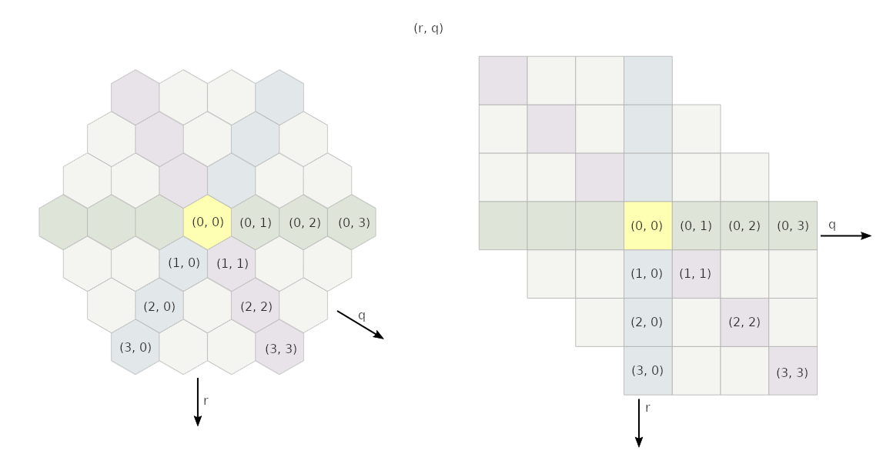

# Implementation report

The program is split into 2 files. `main.rs` contains the UI and minimax algorithm, `board.rs` contains the board and related data types, and their methods.

The program is written in Rust.

## UI

The UI is a command line UI. User enters boards in a text format described in the user guide. These board strings can be parsed into a 2d array data structure called `Board` with `Board.parse` and a Board can be written back into string with `Board.write`.

## Minimax

This program uses the minimax algorithm for selecting the best move. The search tree is too large to be traversed completely, so it is limited to a depth of 7 turns, where heuristic evaluation is used instead.

It has been written in a form called [negamax](https://en.wikipedia.org/wiki/Negamax), which means that the same evaluation function can be used for finding both minimum and maximum value.

It has been optimized with [alpha-beta pruning](https://en.wikipedia.org/wiki/Alpha%E2%80%93beta_pruning), move ordering and parallelization.

### Move ordering

Instead of traversing the move tree in a random order, the moves at every level are sorted by their heuristic score and searched best heuristic first. The idea is that searching best moves first causes alpha-beta pruning to happen sooner.

### Parallelization

The top level of the minimax tree is searched in parallel. Instead of evaluating the tree branches one by one, an evaluation job is spawned for each branch and sent to a thread pool for execution. The top level usually has around 40 child branches on the first few turns, so there should be enough jobs for all cores in a modern multicore processor. Deeper levels of the tree do not need to be parallelized.

### Depth

Counting from the bottom, the tree level 0 (leaves) is evaluated using the heuristic evaluation function. The moves are not ordered at all, as they would be ordered by the same heuristic function that they are evaluated with.

The tree levels 1 to 6 are evaluated normally using minimax and move ordering.

The tree level 7 (root) is evaluated in parallel with multiple threads.

### Failed optimizations

Iterative deepening search and transposition tables are known minimax optimizations in the chess world. They were tried, but they did not improve the performance of this program.

## Board

The hexagonal board is stored in a 2d array as a square grid as shown in the image. The data structure is stored in a `Board`. The elements of the array are `Tile`s. A `Tile` may either be a `Stack` of certain player and certain size, `Empty`, or `NoTile`. `NoTile` means that that element of the 2d array is not part of the board.

Straight lines of a hexagonal grid can be traversed by increasing (or decreasing) the first, second or both indexes at the same time.

## Heuristic evaluation

The `Board::heuristic_evaluate` function tries to guess the probability that one player will win. It will give each player a score based on two factors:

-   Blocked score: +1 point for each "free" side of each "free" sheep piece. Free side means that the direct neighbor of the sheep piece is an empty tile. Free sheep piece means that it is not on the bottom of a stack. Maximum of +75 points.

-   Evenness score: -1/2 times the size difference of the largest and smallest stack. Minimum of -7 points.

The heuristic score is the difference in scores of the two players. Negative score means Min has the advantage and vice versa.

### Endgame evaluation

If the heuristic evaluation function determines that one player has won for certain, it returns 1000000 (one million) or -1000000.