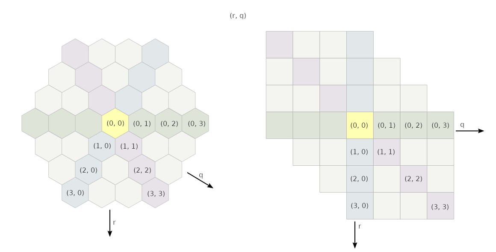

# Requirements
The goal is to implement an AI (or "solver") for the board game Battle Sheep. The rules of Battle Sheep can be found in https://blueorangegames.eu/wp-content/uploads/2017/05/BATTLE-SHEEP_rules_ML.pdf. The original Battle Sheep can be played by 2-4 people. It starts by laying out the board, placing the starting stacks and then taking turns moving them.

In the scope of this project, it is enough if the AI can play a 2 player game with a predetermined board. The AI should on average complete one turn in 500 ms on a modern computer, which is roughly the time that the best human players would need to move their stacks. The time may vary substantially from turn to turn depending on how complex the situation in the game is. The game can be played in two modes: AI vs AI and AI vs human.

## UI
In the MVP version there is a text based command line interface.

### Inputs
The user needs to select the game mode (AIvsAI or AIvsHuman) and give the program a pregenerated board. In the AI vs human mode the human will be prompted for a new board after every turn. In the MVP version the human plays their turn by copying the output board of the previous turn, making a modification and pasting the board back to the program.

### Outputs
The board is printed in the console after every AI turn until one player wins the game.

### Format of the hexagonal board
The input and output boards are formatted in the console as a hexagonal looking grid of ascii characters, which denote players and stack sizes.

In battle sheep, finding straight lines on the board is important. On the ascii grid, straight lines can be found on the horizontal, descending diagonal, and ascending diagonal axes. The vertical axis does not represent a straight line.

## Optional features
- Easier UI for playing the human's turn in AI vs human mode.
- Graphical UI for displaying the board
- Support more than 2 players
- AI for generating the board

# Implementation details

## Possible moves
In a 2 player game there is a maximum of 15 rounds before both players have fully spreaded their stacks. Every round has 2 turns, one for each player.

On the first round there are 15 ways to split the stack and the number goes down by 1 on every round. There must be an obstacle on at least one side of a stack, so there is a maximum of 5 directions the top part could go. Therefore one upper bound for the number of possible moves on one turn is  where n is the number of the round.

An upper bound for the number of possible games is . These upper bounds assume that the board is infinite. In reality there are probably smaller upper bounds that depend on the board size.

## Solver algorithms
Minimax algorithm with alpha-beta pruning is used for choosing the best move. The game tree is too large to be traversed completely, so a heuristic function will be used to evaluate game states at some depth in the tree. The heuristic algorithm has not yet been decided.

## Hexagonal grid

The hex grid is stored in a 2-dimensional array as a square grid as shown in the image. Unused tiles are filled with the Rust equivalent of null. Straight lines can be traversed by increasing (or decreasing) the first, second or both indexes at the same time.

## Programming language
Rust

## Language of documentation
English

# About me
**Preferred peer review languages (in order):** Rust, Java, Javascript, Python

**Degree programme:** Tietojenkäsittelytieteen kandiohjelma

# References
- Algorithms for hexagonal grids: https://www.redblobgames.com/grids/hexagons/
- Minimax and alpha-beta pruning: https://materiaalit.github.io/intro-to-ai/part2/